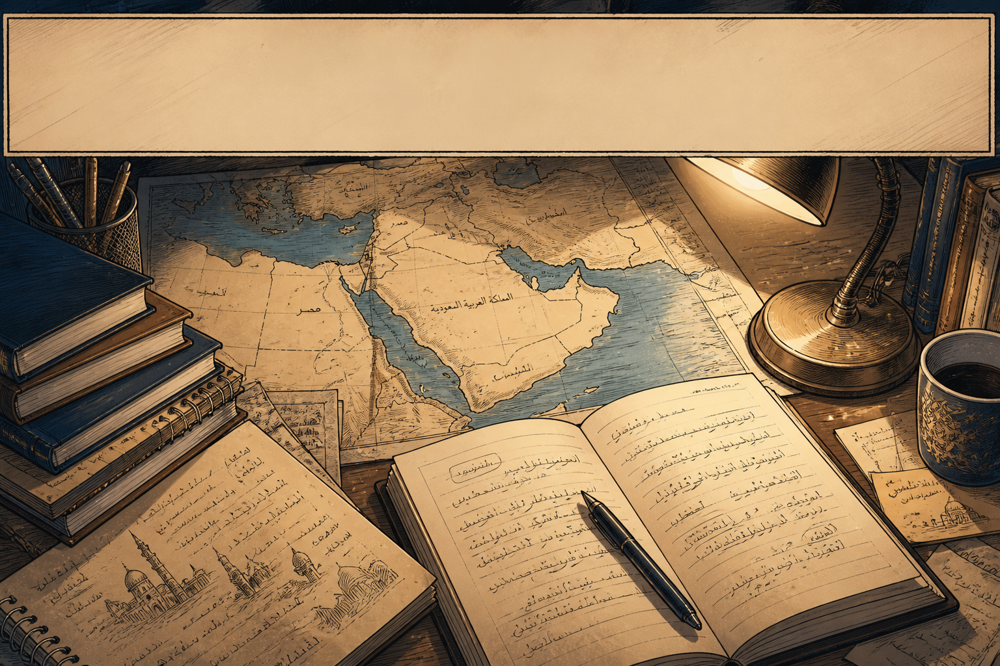
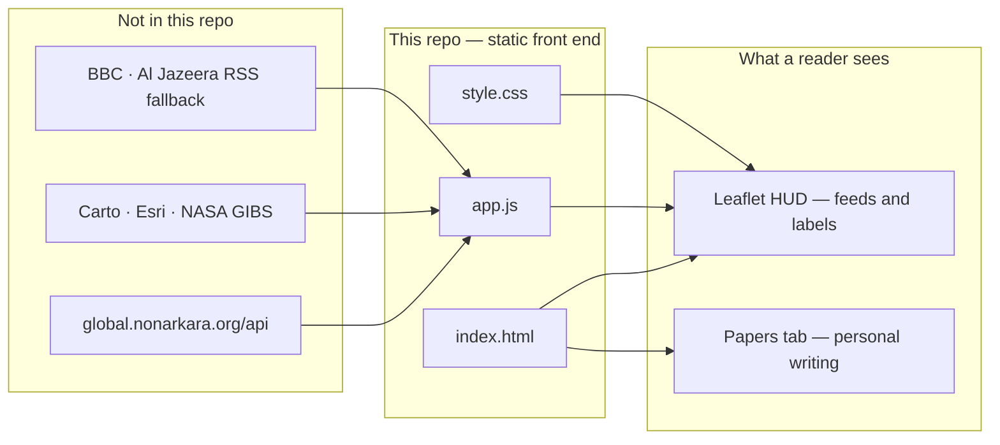

<p align="center">
  
</p>

<p align="center"><em>Hero art only. The blank parchment HUD across the top of the drawing is illustration — not a title plate, and not a capture of the running MEM dashboard.</em></p>

# MEM by NON

A personal, fast regional reading desk for the Middle East. The browser opens a static Leaflet HUD — intel headlines, conflict events, satellite and thermal overlays, markets, and a small set of analyst-coded panels — then, in a separate tab, a first-person essay about why the desk exists.

Created by [Dr. Non Arkaraprasertkul](https://github.com/Nonarkara). In the app’s own Papers tab, MEM is the fast monitor in a family of four (AsiaWatch, GlobeWatch, World Console, MEM). The chrome labels this copy a **legacy monitor** and points at the fuller GlobeWatch build.

**This is not official intelligence.** The war-room skin is a reading device. Some figures arrive from a remote API and public tiles; some are curated, sampled, or written by hand. The Papers essay is writing, not a feed.

**Live (verified against this tree):** [Cloudflare Pages](https://mem-by-non.pages.dev) · [GitHub Pages](https://nonarkara.github.io/mem-by-non/)

The GitHub homepage field still points at `https://mem-by-non.vercel.app`. That hostname currently returns **no deployment**. Do not treat it as a live site.

---

## What this is

This repository is the **front end only**. `index.html`, `app.js`, and `style.css` are the product. There is no bundler, no npm install (`package.json` is name and version only), and no application backend here. Live numbers are not stored in this repo. This README does not publish casualty figures.

On screen: a full-bleed map; a glass HUD; tabs for INTEL, CONFLICT, SAT, PREDICT, PAPERS (and DATA on a narrow viewport); a right-hand data wall; a layer dock; theatre shortcuts (ME, IR, GZ, YE, Hormuz).

| Surface | What you are looking at |
| --- | --- |
| **Header** | UTC clock; “days of conflict” counted from `2026-02-28T00:00:00Z` in `app.js`; escalation gauge from the API; event / KIA / fire / source pills filled from feeds (`--` until data arrives) |
| **Intel** | Headlines from the API ticker, with BBC World (Middle East) and Al Jazeera RSS as fallback |
| **Conflict** | GeoJSON events from the API (ACLED-shaped). The strike log says **LIVE** only when the feed is not a curated fallback |
| **SAT** | NASA GIBS MODIS true color (~two-day lag), aerosol/dust overlay, NASA FIRMS thermal detections |
| **Predict** | Hand-set scenario markers — not a live poll or computed forecast (the pane says so) |
| **Papers** | A personal origin essay. Not a data feed. |
| **Data wall** | Satellite stack, market impact, active fronts, conflict hotspots, strike log, nuclear-site rows, source health |

Nuclear-site rows and a fronts fallback are **coded in the client**. Treat them as UI fixtures, not independently verified tallies.

It is **not** [`middleeast-monitor`](https://github.com/Nonarkara/middleeast-monitor). That sibling is a different product — a single-file news-wall / OSINT console. They share sponsor/About copy and a similar civic subject. They do not share this file layout or this fetch architecture. See [Ethical use](#ethical-use).



Related dashboards named in the UI (siblings, not this repo):

| Monitor | URL |
| --- | --- |
| GlobeWatch (full version) | https://globalmonitor.nonarkara.org/ |
| AsiaWatch | https://asia.nonarkara.org |
| World Console (API host) | https://global.nonarkara.org |
| Middle East // War Monitor (different app) | https://middleeast-monitor.pages.dev |

---

## Philosophy

Civic work earns attention by being honest about what it does not know.

MEM exists so a reader can put **a few public sources on one fast axis** — headlines, conflict events, thermal hits, markets, a satellite mosaic — and see where they agree, where they lag, and where the page is only filling space. The Papers tab is the author’s reason for building the desk: something better to look at than a headline, kept fixable by a person. That essay is motivation. It is not a certification.

The dark “operations” skin is a reading device, not a claim of authority. A LIVE badge means the client is cycling a feed that is not a curated fallback — not that a government desk certified the numbers. “UNCLASSIFIED // FOR OFFICIAL USE ONLY” is chrome. The four-monitor family (wide / deep / planetary / fast) is how the studio keeps each desk from becoming a copy of the others. This one is built to be fast.

Fork it, retarget the geography, or strip the hand-set panels. Keep the labels. A dashboard that cannot say “this is curated” or “this is writing” is furniture.

---

## Ethical use

**Not official intelligence. Not policy guidance. Not a casualty authority.**

Two things share one window. Do not collapse them.

### Personal writing vs live monitor

| | Personal writing | Live monitor |
| --- | --- | --- |
| **Where** | Papers tab; this README; the hero illustration | Map, INTEL, CONFLICT, SAT, data wall, ticker |
| **What it is** | A first-person origin essay and studio framing | A client that polls a remote API and public tiles/RSS |
| **What it is not** | A sitrep, a feed, or evidence that the HUD is official | A ministry COP, a classified product, or a complete archive |

The essay can talk about ministries, satellites, and speed. That does not make the map an official product. The map can look like a watch floor. That does not make the essay a live source.

### Distinct from `middleeast-monitor`

| | This repo — `mem-by-non` | [`middleeast-monitor`](https://github.com/Nonarkara/middleeast-monitor) |
| --- | --- | --- |
| Name | MEM by NON | Middle East // War Monitor |
| Layout | Split `index.html` + `app.js` + `style.css` | One HTML file, CSS/JS inlined |
| Data path | Client calls `https://global.nonarkara.org/api` | Browser fetches RSS/APIs (often via a CORS proxy) |
| Surface | Tabbed MEM, including a Papers essay | News wall, keyword conflict cards, below-fold tables |
| Live | [mem-by-non.pages.dev](https://mem-by-non.pages.dev) | [middleeast-monitor.pages.dev](https://middleeast-monitor.pages.dev) |

They are independent conflict-reading surfaces. Do not treat one as a backup of the other, and do not cite them as a single system.

### Honesty already in the client

| Class | What it means here | Where |
| --- | --- | --- |
| **Live / measured** | A public path returned a payload, and the UI shows that payload or a simple aggregate of it | API ticker when it answers; NASA GIBS MODIS / AOD tiles; FIRMS when the backend is not on a sample set; markets when the API answers |
| **Curated / fallback** | The conflict source includes `fallback`. The strike log then says **CURATED STRIKE LOG**, not LIVE | Conflict pane, strike log, KIA pill (sum of `properties.fatalities` on whatever arrived) |
| **Sample** | Thermal detections are a backend sample set, not live NASA. The fires pill is titled accordingly | FIRMS path when `source` includes `sample` |
| **Hand-set / fixture** | Written in `app.js` and updated by hand, or shipped so a panel is never empty | Predict percentages; `NUC` site rows; fronts fallback if the API returns nothing; “days of conflict” epoch |
| **Writing** | Prose, not a feed | Papers tab |

This README does not republish KIA totals, seed figures, or API payloads. If a badge says CURATED, SAMPLE, or the Predict note says “analyst-set” — believe the badge.

**Do not treat this display as:** a ministry product, a military COP, a humanitarian cluster sitrep, or evidence in court. Authors are not liable for decisions made from it.

This README does not document analytics tokens, visitor-webhook URLs, deploy-tool account IDs, or backend keys. Live thermal data, when it is live, is a key on the **API host**, not in this repo.

---

## How to read

Read the HUD as a **labeled viewer**, then read Papers as **writing**.

1. **Start on the map.** Dark / SAT / NASA bases and AOD · CONFLICT · THERMAL · NEWS overlays. The layer dock tells you what is on. Preset zooms jump to the theatre, Iran, Gaza, Yemen, or Hormuz.
2. **Read the badges before the counts.** LIVE vs CURATED on the strike log; sample vs live on the fires pill; `--` means the client has not filled that pill yet. KIA is a sum of the current conflict payload, not a table shipped in this repo.
3. **INTEL is headlines.** Click a card to fly to a guessed coordinate, or to open a link. Coordinates are keyword matches against a small gazetteer in `app.js`, not geocoded news.
4. **SAT lags.** MODIS true color and AOD are dated about two days behind. Thermal points are FIRMS detections or a sample set — the pill title says which.
5. **PREDICT is not a market.** Percentages are analyst-set markers. The pane’s own note: read as “what’s plausible right now,” not a forecast with a track record.
6. **PAPERS is the essay.** Origin story, the four-monitor family, and a satellite-honesty note. It does not update with the feeds. Do not quote it as a live sitrep.
7. **The About modal** credits PMU A, depa, Axiom, and ReTL, and names Dr. Non Arkaraprasertkul and Associate Professor Dr. Poon Thiengburanathum. That is sponsorship and authorship copy, not a classification marking.

Refresh cadence in `app.js`: escalation and fronts every 5 minutes, conflict and FIRMS every 10, markets every 2, news every 3.

### Open the desk locally

Any static file server works. The dashboard fetches the remote API and map tiles, so it needs a network.

```bash
git clone https://github.com/Nonarkara/mem-by-non.git
cd mem-by-non
python3 -m http.server 8080
```

Open [http://localhost:8080](http://localhost:8080). Opening `index.html` as `file://` may block some fetches.

```
index.html    # HUD, map root, About modal, Papers essay
app.js        # map, overlays, API clients, fallbacks, hand-set panels
style.css     # war-room layout
docs/hero-banner.png   # README illustration only — not UI chrome
404.html      # older static copy (legacy 404 page)
vercel.json   # Vercel SPA rewrite (hostname currently undeployed)
package.json  # name/version only
LICENSE       # MIT
```

`.netlify/` and `.wrangler/` are local deploy-tool cache, not app source.

---

## License

[MIT](LICENSE). Copyright (c) 2026 Dr. Non Arkaraprasertkul.

Data remains with its providers (the API host, newsrooms, NASA GIBS / FIRMS, Carto, Esri, and the others named above). The banner illustration is atmosphere for this README, not a depiction of classified systems and not a screenshot of the live HUD.

The in-app About modal still contains a separate informational / OSINT disclaimer. This file does not change the UI.
